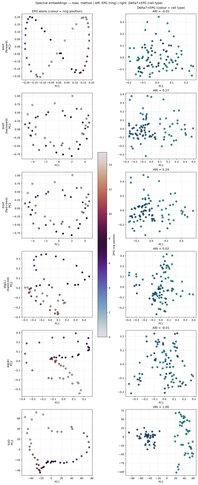
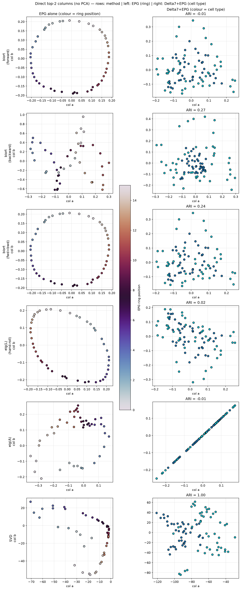

# Spectral Embeddings of the Ring Connectome: SVD vs eig(A) vs Diffusion

Three unsigned spectral embeddings, compared on the hemibrain central-complex
connectome (EPG = 46 neurons; Delta7 + EPG = 88). The question that motivates the
comparison: with the connection **sign discarded**, which spectral method
recovers which structure — the EPG **ring** and/or the Delta7/EPG **cell-type**
split? Numbers below come from `notebooks/biort_embedding_exploration.ipynb`.

---

## The three operators

All three act on the unsigned adjacency `A` (or a normalization of it), but they
decompose different operators in different ways:

| method | operator | decomposition | normalization | modes ranked by |
|---|---|---|---|---|
| **diffusion** | `L = I − P`, `P = D_out⁻¹A` | **eigenvectors** (slowest) | row-stochastic (**out-degree erased**) | timescale (`λ`→0) |
| **eig(A)** | raw `A` | **eigenvectors** (dominant `\|λ\|`) | none (raw magnitudes) | centrality (`\|λ\|`) |
| **SVD** | raw `A` | **singular vectors** | none (raw magnitudes) | connection energy (`σ`) |

"Diffusion" is computed **two ways**, and both are reported below:
- **`biort` bi-embedding** (`src/biort/biort.py`): teleported transition matrix
  (`α = 0.95`), realified, stacking the **forward (right)** and **backward (left)**
  slow eigenvectors `[Re(V) | Re(U)]`. This is what the rest of the notebook
  (ring-manifold, k=2 panels) uses. Below it is also split into its forward-only,
  backward-only, and forward+backward parts.
- **`eig(L)`, hand-rolled**: raw `P = D_out⁻¹A` (no teleportation), **forward
  (right) eigenvectors only**, `[Re(V) | Im(V)]`.

They differ in teleportation, realification, and which modes are kept, so they are
*not* the same vectors. `eig(A)` and SVD are computed directly in the notebook.

---

## 1. Eigenvectors vs singular vectors (and eig(A) vs eig(L))

**Eigenvectors** solve `A v = λ v`: the **invariant directions** of the map —
what repeated application `x → Aᵗx` preserves (up to scaling `λᵗ`). They describe
**dynamics**. For non-symmetric `A`, eigenvalues are complex and the right
eigenvectors `{vᵢ}` pair with left eigenvectors `{uᵢ}` bi-orthogonally
(`uᵢᴴvⱼ = δᵢⱼ`).

**Singular vectors** give `A = Σᵢ σᵢ uᵢvᵢᵀ` with `σᵢ ≥ 0` and **two** orthonormal
bases (input `V`, output `U`). They are the **maximal-stretch directions** — the
**geometry/structure** of the map, and for an adjacency matrix, the dominant
row/column (out-profile/in-profile) connection patterns.

**They coincide iff `A` is normal** (`AAᵀ = AᵀA`); then `σᵢ = |λᵢ|` and the
eigenvectors are orthonormal. The further from normal, the more eig and SVD
diverge — *this divergence is the whole story below.*

**eig(A) vs eig(L) — two eigen-methods that differ by normalization.** Both are
"dynamics" views, but:
- `eig(A)` uses raw `A`; its leading eigenvector is the **Perron / eigenvector-
  centrality** mode (all-positive, weighted by connection magnitude).
- `eig(L)` first makes `P = D_out⁻¹A` row-stochastic, which **divides out each
  node's out-degree** (every row of `P` sums to 1 — verified, min = max = 1.000).
  Its slow modes are **diffusion coordinates**: smooth functions grouping nodes
  that are slow to mix.

So three knobs distinguish the methods: **eigen vs singular** (dynamics vs
structure), and within eigen, **raw vs row-normalized** (centrality vs diffusion).

---

## 2. The comparison on data

### Empirical summary

| quantity | EPG alone | Delta7 + EPG |
|---|---|---|
| asymmetry `‖A−Aᵀ‖/‖A+Aᵀ‖` | 0.16 | 0.49 |
| non-normality `‖AAᵀ−AᵀA‖/‖A‖²` | 0.09 | 0.32 |
| diffusion spectral gap (2nd `\|eig L\|`) | 0.056 | 0.707 |
| top singular values | 191,172,151,… (gradual) | **753**,309,293,… (one dominant) |
| top `\|eig(A)\|` | 188,169,147,… (gradual) | **701**,160,160,133,… (Perron + ring pair) |

### Benchmarks

Two scalar benchmarks per method — **EPG ring correlation** (does a leading mode
trace the ring?) and **Delta7 + EPG cell-type ARI** (do the K=2 clusters equal the
cell types?). The `biort` diffusion bi-embedding is split into its **forward**
(right-eigenvector) and **backward** (left-eigenvector) halves and the full
**forward+backward**, alongside the hand-rolled `eig(L)`, `eig(A)`, and SVD:

| method | EPG ring corr ↑ | Delta7+EPG cell-type ARI ↑ |
|---|---|---|
| diffusion — `biort` forward (right modes) | **0.99** | −0.01 |
| diffusion — `biort` backward (left modes) | 0.91 | 0.27 |
| diffusion — `biort` forward+backward | **0.99** | 0.24 |
| diffusion — `eig(L)`, hand-rolled (forward only) | **0.99** | 0.02 |
| `eig(A)` | 0.84 | −0.01 |
| SVD of `A` | 0.80 | **1.00** |

> **ring corr** `= max(|pearson(mode, cos θ)|, |pearson(mode, sin θ)|)` over a
> method's leading modes, `θ = 2π·(ring index)/16`; 1 ⇒ the mode is a pure ring
> harmonic. **ARI** = adjusted Rand index of the K=2 clustering vs the two cell
> types; 1 = perfect, 0 = chance.

Two readings stand out. (i) **No diffusion variant separates the cell types** —
the best, the backward modes at ARI 0.27, is far below SVD's 1.00; forward modes
are a pure ring (−0.01). The bi-embedding's modest 0.24 comes entirely from its
backward half, since left eigenvectors weight nodes by *in/observation* role,
where the EPG/Delta7 asymmetry partly lives. (ii) All diffusion variants trace the
ring (0.91–0.99).

Every number in both tables is computed and printed by the notebook's
**"Diagnostics & benchmarks"** cell — the doc transcribes notebook output. The
6×2 figure below is produced by the same notebook:

*Rows = embedding; left = EPG alone (colour = ring position); right = Delta7 + EPG
(colour = cell type, K=2 ARI in title). Each panel is **PCA(2) of that method's
full embedding matrix** — PCA is applied to the n×features array the method
produces (e.g. `[Re(V)|Im(V)]` for eig(L), `[U·S|V·S]` for SVD), purely to project
to 2-D for the scatter; the K=2 clustering and ARI use the **full** embedding, not
this 2-D projection. Every embedding traces the EPG ring; only SVD separates the
two cell types.*

The same six embeddings plotted with their **leading two columns directly (no
PCA)** — confirming the PCA panels above are just rotations of these (`biort`
forward's direct columns reproduce `biort_epg_ring_manifold` exactly, to machine
precision):

*Direct top-2 columns instead of PCA(2); K=2 ARI (right) is still computed on the
full embedding. `biort` forward / fwd+bwd and `eig(L)` give the clean ring. Some
methods look degenerate in raw columns — `eig(A)`'s columns 1–2 are the real parts
of a conjugate eigen-pair (they collapse toward a line) and the `biort` backward
ring harmonic lives in later columns — which is why PCA(2) is the cleaner default
view.*

### 2.1 EPG alone — all three recover the ring

The EPG subgraph is nearly symmetric and **near-normal** (0.09), so eig and SVD
*must* largely agree, and they do — every method lays the 46 neurons on a loop
ordered by ring position:

- diffusion **0.99** (cleanest: slow Laplacian eigenvectors *are* the smooth ring
  harmonics, ordered by spatial frequency),
- eig(A) **0.84** (dominant eigenvectors of the near-circulant ring are the same
  harmonics),
- SVD **0.80** (also the ring, but ordered by connection *energy*, so mixed with
  degree/magnitude variation → slightly noisier).

The singular values decay gradually (191, 172, 151, …): many comparable harmonics,
the spectral signature of a ring.

### 2.2 Delta7 + EPG — only SVD separates the cell types

Adding Delta7 makes `A` strongly directed (0.49) and **non-normal** (0.32). Now
the methods genuinely diverge, and **only SVD** aligns with cell type:

- **SVD — ARI 1.00.** One singular value dominates (`σ₁ = 753` vs `σ₂ = 309`).
  That rank-1 component is the **role contrast**: EPG rows are out-heavy sources
  (out/in ≈ 1.74), Delta7 rows in-heavy sinks (≈ 0.75), atop different block
  densities (D7→D7 dense/strong, EPG→EPG sparse/weak). k-means on the
  co-embedding recovers Delta7 42/0, EPG 0/46.
- **eig(A) — ARI −0.01.** *Even on the raw matrix, the eigenvectors miss it.* The
  dominant **eigenvalue** (701) is the Perron/centrality mode — it is only 0.68
  correlated with cell type and is not a clean cluster axis; the next eigenvectors
  (160, 160 — a conjugate pair) are ring-like and carry no cell-type signal
  (corr 0.02). The cell-type contrast is a **maximal-stretch (singular)** direction,
  **not an invariant (eigen)** direction — and for this non-normal `A` the two are
  different (`σ₁ = 753` ≠ `λ₁ = 701`, different vectors).
- **diffusion — ARI ≤ 0.27.** Every variant misses it: hand-rolled `eig(L)` 0.02,
  biort forward −0.01, biort forward+backward 0.24, biort backward 0.27 (the best,
  because left modes carry some in/observation-role signal — still far below SVD).
  Two further reasons in the next section.

The key lesson: **both eigen-methods (dynamics) fail; only the singular-vector
method (structure) succeeds.** "Raw vs normalized" is a red herring here — `eig(A)`
keeps the magnitudes and still fails, because the failure is about *eigen vs
singular*, not about normalization.

### 2.3 Why diffusion in particular cannot separate the two cell types

Beyond the eigen-vs-singular point, the diffusion embedding has two extra strikes
against it for the combined network:

1. **The spectral gap collapses (0.056 → 0.707).** EPG alone has a small
   second-smallest Laplacian eigenvalue — a genuine slow mode (the ring). For the
   combined network the second eigenvalue jumps to **0.707**: there is no slow
   community structure at all. Delta7 and EPG are reciprocally, densely wired
   (D7↔EPG densities 0.51 / 0.89), so a random walker crosses between the two
   populations almost immediately — they are **one diffusion community**.
   Diffusion separates things that mix *slowly*; these types mix *fast*.
2. **Row normalization deletes the cleanest cue.** `P = D_out⁻¹A` forces row sums
   to 1, removing the out-strength difference (EPG out/in ≈ 1.74 vs Delta7 ≈ 0.75)
   that most cleanly distinguishes the types. SVD on raw `A` keeps it.

For EPG alone none of this bites: near-normal, a real slow ring mode, and the ring
(not degree) is the dominant structure — so all three agree.

---

## 3. Practical guidance

- **Dynamical / functional grouping** (communities, attractor geometry, smooth
  coordinates like the ring): use **diffusion** (slow eigenvectors of `L`). Needs
  near-normality and a spectral gap.
- **Structural / role grouping** (cell types, source/sink roles, blocks) from
  unsigned data: use **SVD of `A`** (or degree features). Robust to strong
  directionality and non-normality; keeps raw magnitudes; aligns with the dominant
  connection contrast.
- **`eig(A)` sits in between and is the trap**: it keeps magnitudes (unlike
  diffusion) but, being an eigen-decomposition, still reports invariant/centrality
  directions rather than the block contrast — so for non-normal connectomes it
  behaves like diffusion (misses cell type), not like SVD.
- **Cheap diagnostics that predict the outcome**: the **non-normality** ratio (do
  eig and SVD even differ?), the **diffusion spectral gap** (is there slow
  community structure?), and the **singular-value decay** (one dominant `σ` ⇒ a
  strong rank-1 block contrast SVD will find). Caveat: degree-correcting models
  (DC-SBM) *remove* the degree signal — here that erases the cell-type cue
  (ARI ≈ 0.07).

---

## References
- Trefethen & Embree (2005), *Spectra and Pseudospectra* — non-normal operators; eig ≠ SVD.
- Von Luxburg (2007), "A tutorial on spectral clustering" — Laplacian eigenmaps, spectral gap.
- Coifman & Lafon (2006), "Diffusion maps" — eigenvectors of `P` as diffusion coordinates.
- Newman (2013), "Spectral methods for community detection and graph partitioning."
- Code: `src/biort/biort.py` (diffusion embedding); `notebooks/biort_embedding_exploration.ipynb` (eig(A), SVD, three-way comparison, all figures); `scripts/ring_preprocessing.py` (loader).
